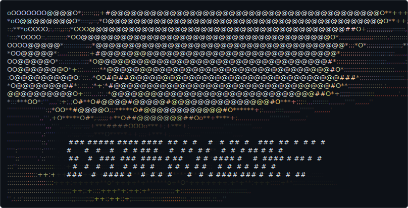

  <picture>
    <source media="(prefers-color-scheme: dark)" srcset="assets/header-dark.svg">
    <source media="(prefers-color-scheme: light)" srcset="assets/header-light.svg">
    
  </picture>

## Hey, I'm Stefan

<!-- Add your bio, links, and interests here -->

---

### Latest from Bluesky

<!-- BLUESKY:START -->
_Configure your Bluesky handle to see posts here._
<!-- BLUESKY:END -->
